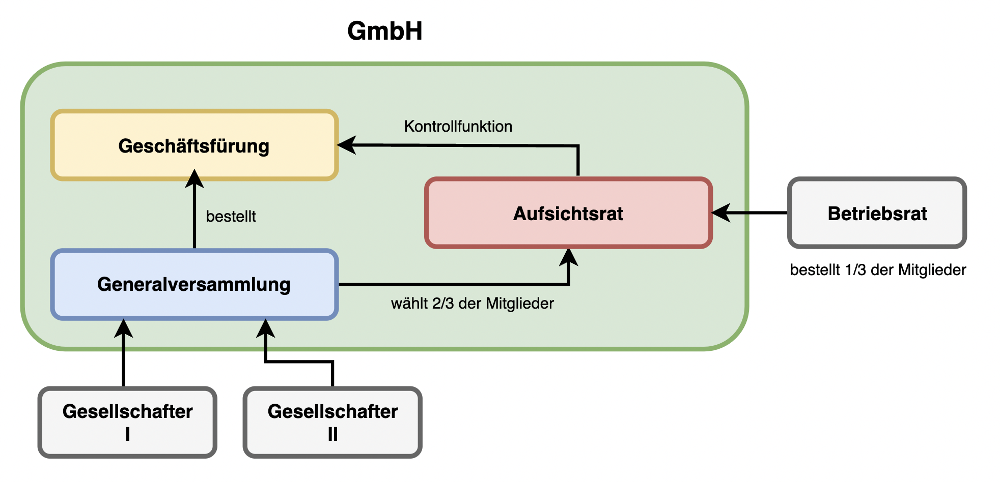
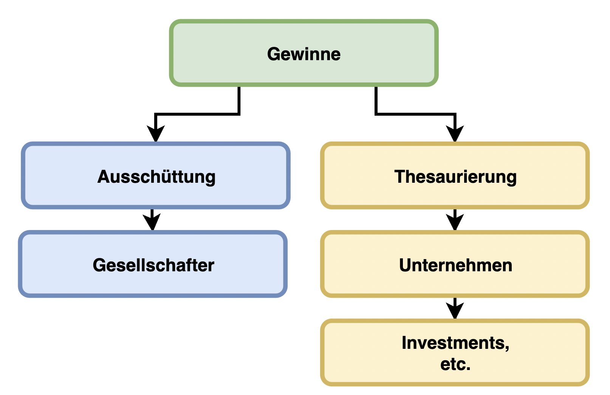

---
title: "Gesellschaft mit beschränkter Haftung"
author: Florian Flatscher, Moritz Mitterdorfer
date: "12. Mai 2022"
subject: "Gesellschaftsformen"
keywords: [GmbH]
subtitle: "4EHIF - 2022 - BWM"
lang: "de"
titlepage: true
titlepage-color: "1171ba"
titlepage-text-color: "FFFFFF"
titlepage-rule-color: "FFFFFF"
titlepage-rule-height: 2
toc: true
toc-own-page: true
book: true
...

# Überblick

Bei der Gesellschaft mit beschränkter Haftung (= *GmbH*) handelt es sich um eine Kapitalgesellschaft, die von
Gesellschaftern gegründet wird und mind. eine natürliche Person zum Geschäftsführer bestellt. Aufgrund Haftungsfragen
und diverser steuerrechtlichen Belangen, ist die GmbH eine beliebete Rechtsform sowohl für Startups als auch für
beständige Klein- und Mittelbetriebe. Sie stellt eine eigene juristische Person dar und unterliegt den Gesetzen des UGB.

Key-Facts:

- Kapitalgesellschaft
- Stammkapital durch Stammeinlagen
- beschränkte Haftung
- eigene juritische Person

# Zweck

Die Gründung der GmbH kann für jeden erlaubten Zweck erfolgen. Nicht erlaubt sind Zwecke verbunden mit:

- Versicherungen
- Bankgeschäfte
- Apotheken
- Notariate
- Tabak-Trafiken
- Rauchfangkehrer
- politischen Parteien

# Anwendbares Recht

Generell gilt für die GmbH das Unternehmensgesetzbuch (= UGB). Dazu kommen die Regelungen, die im Gesellschaftsvertrag
bestehen. Es gilt: Bei allem, was im Gesellschaftsvertrag nicht geregelt ist, greift das nationale oder etwaiges
transnationales Recht.

# Gründung

Die Gründung einer GmbH erfolgt im Gegensatz zu Personengesellschaften durch eine natürliche Person. Bei der Gründung
einer solchen Rechtsform muss nach der Art der GmbH unterschieden werden:

## Traditionelle Gründung
Ein Gesellschaftsvertrag wird zwischen allen Gesellschaftern in notariell beglaubigter Form abgeschlossen und gilt damit fortan. Der Vertrag muss dabei schriftlich sein und folgende Punkte beinhalten:

Ein Gesellschaftsvertrag wird zwischen allen Gesellschaftern in notariell beglaubigter Form abgeschlossen und gilt damit
fortan. Der Vertrag muss dabei schriftlich sein und folgende Punkte beinhalten:

| gesetzlicher Mindestinhalt       | optionaler Inhalt                              |
|----------------------------------|------------------------------------------------|
| Firma und Sitz der Gesellschaft  | Gründungsprivileg                              | 
| Gegenstand des Unternehmens      | Regelungen zur Geschäftsführung und Vertretung | 
| Höhe des Stammpaitals            | Generalversammlung                             | 
| Stammeinlagen der Gesellschafter | Beschlussfassung der Gesellschafter            |
|                                  | Gewinnverwendung                               |
|                                  | Aufgriffsrecht bzgl. Geschäftsanteilen         |
|                                  | Minderheitenrechte                             |
|                                  | ...                                            |

> Stammeinlagen der Gesellschafter: Betrag von jedem Gesellschafter, der auf das Stammkapital eingezahlt werden muss

Nachdem der Gesellschaftsvertrag fertiggestellt ist, wird die erste funktionale Geschäftsführung der GmbH bestellt.
Diese setzt sich aus einer (immer bei der Ein-Mann-GmbH) oder mehreren natürlichen Personen zusammen und trägt fortan
die Management-Entscheidungen der Gesellschaft.

Nach der konstitutiven Eintragung der Gesellschaft durch alle perönlich anwesenden Geschäftsführer ins Firmenbuch, ist
sie offiziell gegründet. Folgende Doukmente sind für die Eintragung notwendig:

- Gesellschaftsvertrag/Erklärung über die Errichtung der GmbH (notarielle beglaubigt)
- Gesellschafterliste
- Unterzeichnung der Gesellschafter
- Geschäftsführerverzeichnis
- Bankbestätigung (Einzahlung der Einlagen)
- evtl. Gutachten über den Firmenwortlaut

Sofern das Neugründungsförderungsgesetz nicht anwendbar ist, fallen bei der Eintragung ins Firmenbuch Gerichtsgebühren
an.

> Tipp: Bei der Gründung einer GmbH können eine Vielzahl von Privilegien und allgemeinen Förderungen in Anspruch
> genommen werden. Ein Beispiel hierfür ist die Jungunternehmer Top-Prämie die ab einer MIndestinvestition von €100.000,
> 10 % der Summe beträgt. Andere Förderungen: Austria Wirtschaftsservice (Aws), NeuFÖG (NeugründerInnen Förderungsgesetz)

## Alternative - Vereinfachte Gründung

Ungefähr 38 % aller GmbH-Gründung erfolgen durch eine einzige Person als Geschäftsführer und Gesellschafter. Liegt
sowhol ein Gesellschaftsvertrag als auch diese Voraussetzungen vor, kann die GmbH ohne Involvierung eines Notars auf
digitalem Weg gegründet werden. Dazu ist die elektronische Bürgerkarte und Zugang zum Unternehmensserviceportal
notwendig.

Der Vorteil hierbei ist, dass die Bank die Identität des Gründers prüft und bestimmte Dokumente an das Firmenbuchgericht weiterleitet, was zeitlich und aufandstechnisch ein großer Vorteil ist.

# Gründungsprivilegien

Allgemein beträgt das Stammkapital der GmbH €35.000, kann aber mithilfe des Gründungsprivilegs auf €10.000 in den ersten
10 Jahren herabgesetzt werden. Davon müssen €5.000 direkt bar eingezahlt werden - die andere Hälfte kann durch
Sacheinlagen erfolgen. Das Stammkapital ist bei Inanspruchnahme jedoch nach Ablaufen der 10-Jahres-Frist auf die
vorgeschriebenen €35.000 zu erhöhen.

Das Gründungsprivileg kann nur im Zuge der Gründung der GmbH angewendet werderden und muss hierbei in den
Gesellschaftsvertrag aufgenommen werden.

# Firma
Der Name der GmbH muss den Zusatz "GmbH", "Ges.m.b.H." oder "Gesellschaft m.b.H." führen und darf einen Namen, eine Sache, oder eine Fantasiebezeichnung beinhalten, wobei diese Namen nicht täuschend sein dürfen. Gegebenenfalls kann bei bestimmten Organisationen, wie der WKO, ein Check des Namens auf Rechtssicherheit durchgeführt werden. Der Name der Wortmarke kann auch durch eine Anmeldung beim Patentamt geschützt werden, wobei man dadurch das alleinige Nutzungsrecht des Firmennamens erhält. Der Firmenname wird im Firmenbuch eingetragen. Weriters darf der Name auch Personennamen beinhalten, aber nur die der Gesellschafter.

# Kapital und Rechtspersönlichkeit

Jeder Gesellschafter leistet in Form einer Stammeinlage einen Beitrag zum Stammkapital des Unternehmens. Diese Stammeinlage muss mindestens €70 betragen und darf variieren. Die Summe aller Stammeinlagen der Gesellschafter bildet das Stammkapital, das €35.000 beträgt, durch das Gründungsprivileg aber auch herabgesetzt werden kann. Gesellschaften mit beschränkter Haftung, die aus nur einem Gesellschafter und demnach nur einen Geschäftsführer bestehen werden als "Ein-Mann-GmbH" bezeichnet.

Der Eigentümer des Stammkapitals ist das Unternehmen selbst, was mit seinen finanziellen Mitteln wirtschaften kann.

Die GmbH nimmt eine eigene Rechtsperönlichkeit an. Sie stellt eine juritische Person dar und kann somit Recht erwerben, Verbindlichkeiten eingehen, klagen und geklagt werden. Dies ist ein erheblicher Vorteil, da sie beispielsweise Verträge abschließen oder die Verbindlichkeiten von Geschäften übernehmen kann.

# Haftung
Das Stammkapital gilt als Absicherung, da die Haftung des unternehmerischen Risikos des Unternehmens in der Regel nicht auf etwaiges Privatvermögen der Gesellschafter oder Geschäftsführer entäfllt.

Daher besteht keine direkte oder perönöliche Haftung der Gesellschafter. Jedoch muss sichergestellt sein, dass das Unternehmen über das vorgeschriebene Gesellschaftsvermögen durch miunter das Stammkapital verfügt. Weiters haften Geschäftsführer und Gesellschafter, die mehr als 50 % der Stammeinlage halten, mit einer Höhe von €4.000 für Kosten eines etwaigen Insolvenzverfahrens. 

Also gilt generell: Gesellschafter haften nie mit ihrem Privatvermögen für das Risiko der Gesellschaft, können aber ihre Stammeinlage verlieren.

# Organe

## Generalversammlung

Die Generalversammlung muss mindestens einmal jährlich einberufen werden und besteht aus Gesellschaftern, die aufgrund ihrer eingezahlten Stammeinlage einen Geschäftsanteil besitzen, der durch einen Sitz und ein Stimmrecht in der Generalversammlung symbolisiert wird.

Die Generalversammlung ist also die Versammlung aller Gesellschafter, bei denen Management Entscheidungen bestimmt werden, Auskunft gegeben wird und andere Beschlüsse gefasst werden. Abstimmungen basieren auf dem Merheitsprinzip entsprechend den Geschäftanteilen, wobei mindestens 1/10 des Stammkapitals anwesend sein muss. 

Ein Recht der Generalversammlung ist es, neben den im Gesellschaftsvertrag angeführten anderen Pflichen und Rechten, den anderen GmbH Organen Weisungen zu erteilen:

- Jahresabschlussprüfung
- Beschlussfassung über Verteilung des Gewinns
- Entlastung der Geschäftsführung
- Erteilung der Prokura (= umfassende kaufmännische Vollmacht)
- Vertragsabschlüsse, insbesondere bei Sachkapitalanschaffungen, die 20 % des Stammkapitals übersteigen
- Änderung des Gesellschaftervertrags (3/4 Mehrheit notwendig)

Außerdem erfüllt die Generalversammlung zwei wichtige Aufgaben:

- Bestellung des Geschäftsführers
- Wahl 2/3 der Mitglieder des Aufsichtsrats

## Aufsichtsrat

Die zentrale Aufgabe ist es, die Geschäftsführung zu kontrollieren. Beispielsweise wird eine Abschlussprüfung am Jahresende vollzogen. Die Errichtung dieses Organs ist notwendig, wenn mehr als 300 ArbeitnehmerInnen beschäftigt sind oder mehr als 50 GesellschafterInnen mehr als €70.000 Stammkapital haben. Wie vieles, kann der Aufsichtsrat jedoch auch freiwillig errichtet werden.

Die Mitglieder des Aufsichtsrats dürfen nicht Teil der Geschäftsfürhung sein und werden folgendermaßen bestellt:

- 2/3 der Mitglieder von Generalversammlung gewählt
- 1/3 der Mitglieder von Betriebsrat (= Arbeitnehmervertretung) bestellt

Weiters ist der Aufsichtsrat dazu berechtigt, eine Generalversanmlung einzuberufen, wenn dies im Interesse der Gesellschaft erforderlich ist (§ 30j Abs 4 GmbHG). Außerdem muss der Aufsichtsrat bei bestimmen Geschäften seine Zustimmung geben. Auch ist der Aufsichtsrat dazu verpflichtet die Geschäftsführung hinsichtlich ihrer Betribsorientierung fortlaufend zu überprüfen. Grundlegend gewährleistet der Aufsichtsrat also eine mehr oder minder unabhängige Gewalt innerhalb Gesellschaft, die eine prüfende Funktion einnimmt. Dies verbessert auch das Außenbild des Unternehmens enorm, insbesondere bei Fragen des Arbeitsrechts.

## Geschäftsführung und ihre Vertretung

Generelle Definition des handelsrechtlichen Geschäftsführers, wobei zwischen Innen- und Außenverhältnis unterschieden
werden muss:

\

| Innenverhältnis       | Außenverhältnis             |
|-----------------------|-----------------------------|
| Führung der Geschäfte | Vertretung der Gesellschaft |

Die Geschäftsfürhung umfasst die GeschäftsführerInnen, die stets natürliche Personen sind und von der Generalversammlung
bestellt werden. Weiters müssen die Personen eine rechtliche Handlungsfähigkeit aufweisen und sind im Firmenbuch
anzumelden. Die Anzahl der Geschäftsführer wird im Gesellschaftsvertrag geregelt, wobei es mindestens einen
Geschäftsführer geben muss.

Die Tätigkeitsbereiche der Geschäftsführung umfassen:

- Vertretung
- Geschäftsleitung
- Jahresabschluss
- Überwachung der finanziellen Lage
- Sendung von Reports (Jahresabschluss, Lageberichte, etc.) an die Gesellschafter
- Auskunftserteilung an Gesellschafter
- Einberufung der Generalversammlung
- Anmeldung im Firmenbuch

Sofern der Gesellschaftsvertrag keine anderen Regelungen enthält, wird die Gesellschaft durch alle Geschäftsführer
gleichermaßen vertreten (= Gesamtvertretung). Anders hingegen ist die Einzelvertretung, bei der das Unternehmen nur
durch einen einigen Geschäftsführer vertreten wird.

Blickt man auf die Haftung der GmbH und der Geschäftsführung wird klar, dass der Geschäftsführer bei ordentlicher,
gewissenhafter und fachlich einwandfreien Unternehmensfürhung keine persönliche Haftung für das unternehmerische Risiko
der GmbH übernimmt. Verletzt er jedoch eine dieser Pflichten, wird die Haftung gegenüber einzelnen Parteien verletz.

Die Tätigkeit der Geschäftsfürhung endet mit ihrer Abberufung durch einen Beschluss der Gesellschafter. Eine solche Abberufung wird mit einer einfachen Stimmenmehrheit erwirkt und ist jederzeit gültig.

# Gewerbeberechtigung
Eine Vielzahl von Tätigkeiten uneterliegen der Gewerbeordnung. Möchte die Gesellschaft solche Tätigkeiten ausüben, benötigt sie eine Gewerbeberechtigung, die auf die Gesellschaft selbst lautet. Hat nur ein einzelner Gesellschafter eine solche Gewerbeberechtigung, so gilt dies nicht. 

Fällt ein Unternehmen unter die Gewerbeordnung, muss es einen gewerberechtlichen Geschäftsführer bestellen, also entweder den handelsrechtlichen Geschäftsführer selbst oder einen solzialversicherungspflichtigen Arbeitnehmer, der mindestens die Hälte der üblichen wöchentlichen Arbeitsstunden im Betrieb tättig ist.

# Bilanzierungspflicht
Aufgrund der Tatsache, dass die Gmbh unternehmensrechtlichen Regelungen unterliegt, muss sie einen vollen Jahresabschluss aufstellen und diesen beim Finanzamt einreichen. Dieser volle Jahresabschluss umfasst:

- Gewinn- und Verlustrechnung (GuV) - extern
- Bilanz - extern
- Lagebericht - intern
- Eigenkapitalveränderung - intern
- Kapitalfluss - intern

Außerdem muss die Geschäftsführung Auskunft und Informationen gegenüber den Gesellschaftern erteilen, wobei der Jahresabschluss (extern und intern) eine große Rolle spielt. Für das Finanzamt ist neben den steuerrechtlichen Angaben nur die GuV-Rechnung und die Bilanz von Bedeutung (extern).

# Gewinnverteilung und Entnahmerecht
Allgemein können die ausgewiesenen Bilanzgewinne an die Gesellschafter entsprechend dem Gesellschaftsvertrag im Verhältnis ihrer eingezahlten Stammeinlagen ausgezahlt werden, wobei die Kapitalertragssteuer anfällt. Dabei ist jedoch ein Gewinnausschüttungsbeschluss der Gesellschafter notwendig. Die Geschäftsführung ist dazu verpflichtet den betrieblichen Gewinn zu maximieren. Im Gegensatz dazu sind Verluste von der Gesellschaft selbst zu tragen und Gesellschafter haben diesbezüglich keine Pflichten - sofern dies nicht anders im Gesellschaftsvertrag gerelegt ist.

Im Gegensatz zu anderen Gesellschaftsformen ist die GmbH bei voller Gewinnausschüttung aufgrund der Steuern erst bei einer Gewinnschwelle von €345.000 günstiger. Wird das Geld im Unternehmen behalten, spricht man von Thesaurierung, und das die Rentabilitätsgrenze verschiebt sich nach unten.

Neben der Gewinnausschüttung kann auch der Geschäftsführer ein Entgelt beziehen. Dieses Entgeld kann steuerrechtlich stark optimiert werden und wird von der Gesellschafterversammlung festgelegt. Dabei ist es von anderen Faktoren, wie Firmenwagen oder Privatentnahmen des Geschäftsführers abhängig - wobei es stets verhältnismäßig sein muss. Die Höchstgrenze liegt bei €500.000 pro Person und Wirtschaftsjahr. 

Ist der Geschäftsführer auch an der Gesellschaft beteiligt, nennt man ihn Gesellschafter-Geschäftsführer. Durch diese Methode kann die auf den Gewinn angewandte Körperschaftssteuer reduziert werden. Die Art der Besteuerung ist von den Stammkapitalanteilen des Geschäftsführers abhängig:
 
- weniger als 25 %: Geschäftsführerbezüge als "normale" Bezüge aus nichtselbstständiger Tätigkeit
- 25 % oder mehr: wesentlich beteiligter Geschäftsführer
  
Beispiel:

Gessellschaftervergütung / Entgelt:

|                                                 |          |
|-------------------------------------------------|----------|
| Gewinn vor Steuern und Geschäftsführervergütung | 100.000  |
| - Lohnnebenkosten                               | - 7.310  |
| Bruttogeschäftsführerbezug                      | 92.690   |
| - GSVG, ...                                     | - 20.346 |
| - Einkommenssteuer                              | - 19.864 |
| = Nettobezug für Gesellschafter-Geschäftsführer | 52.480   |

Dividendenausschüttung:

|                                                 |          |
|-------------------------------------------------|----------|
| Gewinn vor Steuern und Geschäftsführervergütung | 100.000  |
| - 25 % KöSt                                     | - 25.000 |
| Ausschüttungsbetrag                             | 75.000   |
| - 27.5 % KESTt                                  | - 20.625 |
| = Einkünfte des Gesellschafters                 | 54.375   |

Wenn die gesamten Einkünfte €60.000 übersteigen, ist in der Regel Variante 2: Dividenausschüttung zu vevorzugen.

# Übertragung von Anteilen

Vereinfacht ist der Anteil an einer GmbH das Pendant zu Aktien an einer AG. Gesellschafter haben - sofern nicht anders im Gesellschaftsvertrag geregelt - das Recht, Geschäftsanteile zu verkaufen. Dies muss jedoch notariell beglaubigt und im Firmenbuch angepasst werden. Mit der Übertragung ins Firmenbuch wird der Käufer nun Gesellschafter an der Firma. Wenn ein Anteil an einem renatblen Unternehmen gekauft wird, übersteigt der Kaufpreis i.d.R. die Einlage (= Nominale).

# Steuern

Die Rechtsform eines Unternehmens bestimmt wie **Körperschaftssteuer** und **Einkommensteuern**, oder **
Kapitalertragssteuer**, hand zu haben sind. Für ein neugegründetes Unternehmen ist die GmbH als Rechtsform steuerlich
gesehen oftmals ungünstig. Anders als Personengesellschaften unterliegt die GmbH als Kapitalgesellschaft der
Kapitalertragssteuer und nicht der Einkommensteuer.

#### Körperschaftssteuer (KöSt)

Als juristische Person unterliegt der Gewinn der GmbH der Körperschaftssteuer von **25%**. Wie für alle Kapitalgesellschaften gibt es für die GmbH zusätzlich eine Mindestkapitalsteuer (Mindest-KöSt). Diese gibt vor, als GmbH unabhängig vom Gewinn mindestens €1.750 KöSt pro Jahr anzubringen. Für eine AG
beträgt die Mindestkapitalsteuer €3.500. Allerdings muss seit 2013 nicht von anfang an die volle Kindest-KöSt bezahlt
werden.

| Zeitraum          | Mindest-KöSt pro Jahr |
|-------------------|-----------------------|
| Nach der Gründung | €500                  |
| Nach 5 Jahren     | €1.000                |
| Nach 10 Jahren    | €1.750                |

#### Kapitalertragssteuer (KESt)

Bei der Kapitalertragssteuer handelt es sich um eine Form von Einkommensteuern. Wenn eine beteiligte natürliche Person
einer person aus einer Gewinnausschüttung Geld zieht, dann sind wiederum Kapitalertragssteuer einzubringen. In diesem
Fall handelt es sich um Einkünfte aus Kapitalvermögen und somit beträgt der Steuersatz, seit 2016, **27,5 %**.

Einfach zusammengefasst gibt die GmbH von jedem Gewinn 25 % Körperschaftssteuer ab. Wenn das Geld nicht in der Firmer
bleibt, sondern an die Gesellschafter ausgeschüttet wird, kommt zusätzlich 27,5 % Kapitalertragssteuer hinzu.
Zusammengerechnet gibt es also eine Gesamtbesteuerung von **45,625 %**.

Der Einkommenssteuertarif, bezahlt von Personengesellschaften, ist anders als die Körperschaftssteuer in sieben Stufen
gestaffelt, die von 0 % zu €11.000 bis 55 zu €1.000.000 reichen. Bei €30.000 gibt es mit 2022 max 15 % des Gewinnes zu
bezahlen. Da Körperschaftssteuer, bezahlt von Kapitalgesellschaften, seit 2005 unabhängig von Gewinn ist, gibt es eine
Gewinngrenze, ab der die Gründung einer GmbH steuerlich günstig ist. Die Steuerbelastung von ESt und KöSt ist bei einem
Gewinn von etwa €49.200 ausgeglichen. Rein steuerlich gesehen, macht eine GmbH also ab Jahreseinkommen von über €49.200
sinn, es gibt allerdings auch andere wichtige Faktoren, wie z.B. die Verwaltungskosten, oder die Lohnnebenkosten.

Bei längeren Verlustphasen kann es durch die höhere besteuerung der GmbH also durchaus rentabel zu sein, eine
begünstigte Umwandlung der Rechtsform in ein Einzelunternehmen oder eine Personengesellschaft durchzuführen. Dabei gibt
es ein Umgründungssteuergesetz, längerfristig kann dieses aber weniger als die Mindestkörperschaftssteuer sein. Es gibt
aber bestimmte Kriterien und Auswirkungen einer begünstigten Umwandlung, weshalb diese gut überlegt werden muss.
Beispielsweise gibt es eine sofortige Versteuerung nicht ausgeschütteter Gewinne mit der Kapitalertragssteuer.

# Sozialversicherung

Das GSVG verpflichtet eine Sozialversicherung für die geschäftsführende Gesellschaft einer GmbH. Außerdem gibt es eine Unfallversicherung nach dem ASVG, solange die Gesellschaft Mitglied einer Kammer der gewerblichen Wirtschaft ist. 

Die Pflichtversicherung nach dem ASVG fällt allerdings aus, wenn die geschäftsführende Gesellschaft über 50 % Beteiligung hat, oder mehr als 25 % Beteiligung und zusätzlich beherrschenden Einfluss auf die Betriebsführung vorweist. Die geschäftsführende Gesellschaft unterliegt aber jedenfalls der Pflichtversicherung nach dem GSVG.

# Beendigung der Gesellschaft

Ein Erreichen des Gesellschaftszweckes, ein Zeitablauf, ein Beschluss der Generalversammlung mit einfacher Mehrheit oder Konkurseröffnung können Gründe für die Auflösung einer GmbH sein. Man spricht von einer Liquidation. 

Das Liquidationsverfahren besteht aus folgenden Schritten:

1) **Gesellschafterbeschluss** - In einer Generalversammlung mus ein Beschluss zur Auflösung der GmbH fallen. Lediglich eine Abstimmung ist unzulässig, es braucht einen notariell beurkundeten Auflösungsbeschlusses.
2) **Bestellung des Liquidators** - Der oder die Geschäftsführer werden zu Liquidatoren, die die GmbH nach außen vertreten und die Geschäfte bis zur Löschung aus dem Firmenbuch führen.
3) **Eintragung ins Firmenbuch** - Der Liquidator, als auch der Beschluss zur Auflösung, ist in das Firmenbuch einzutragen. Danach führt die GmbH ein "Liquidations-Firmenwortlaut". 
4) **Aufgaben des Liquidators** - Der Liquidator muss die GmbH bekannte Gläubiger informieren, damit sie die Forderung gegen die GmbH geltend machen. Dies erfolgt durch eine Veröffentlichung im Amtsblatt zur Wiener Zeitung. Des Weiteren hat der Liquidator hat die Aufgabe laufende Geschäfte zu beenden. Nach Befriedigung der Verbindlichkeiten wird das Gesellschaftsvermögen unter den Gesellschaftern aufgeteilt. Wenn die GmbH während dem Liquidationsverfahren zahlungsunfähig ist, müssen rechtzeitig insolvenzrechtliche Schritte eingeleitet werden. 
5) **Beendung der Liquidation** - Nach beendung der Liquidation muss der Liquidator eine Liquidationsschlussbilanz erstellen. Im Anschluss erfolg ein Antrag für die Löschung der GmbH aus dem Firmenbuch. Alle Bücher und Geschäftsunterlagen sind abzugeben.

# Vor- und Nachteile der GmbH

#### Vorteile

- Hohe Flexibilität - Eine GmbH ist für jeden gesetzlich zulässigen Zweck erlaubt
- Beschränkte Haftung - Es gibt i.d.R. keine persönliche bzw. private Haftung der Gesellschafter
- Steuerliche Vorteile - Bei hohen Gewinnen ist die Kapitalertragssteuer geringer als Einkommenssteuer
- Eigene Rechtsfähigkeit - Die GmbH kann selbstständig Geschäfte abschließen
- Voneinander strikt getrennte Organe sind vorgeschrieben und kontrollieren sich gegenseitig
- Mindestkapital - Geschäftspartner wissen dass Kapital im Unternehmen ist

#### Nachteile

- Hohes Mindestkapital - €35.000 müssen vorgewiesen/eingebracht werden - €10.000 mit Gründerprivileg
- Hoher Arbeitsaufwand - Gründung ist verhältnismäßig aufwendig und teuer
- Risiko der persönlichen Haftung - Geschäftsführer haben trotz "begrenzter Haftung" eine Sorgfaltspflicht und können aufgrund dieser in Speizialfällen mit ihrem Privatvermögen haften
- Haftung - Geschäftspartner abgeschreckt von Haftungsbarriere vor Privatvermögen
- Strikte Trennung zwischen Gesellschafter- und Gesellschaftsvermögen
- Steuern trotz Verlust - Die Mindestkörperschaftssteuer muss trotz Verlust eingebracht werden
- Doppelte Buchhaltung - Aufwändigere Buchführung als bei Einzelunternehmen
- Prestige - Geringere Vertrauenszuschreibung als bei der AG

# Beispiele

FLO / MO

# GmbH und Internationalität

Die GmbH besteht als wählbare Rechtsform nicht nur in Österreich, sondern auch im transnationalen Raum. Oft gibt es einige rechtliche Unterschiede zwsichen der österreichischen und ausländischen Form.

| Land       | Begriff                                           | Unterschiede                         |
|------------|---------------------------------------------------|--------------------------------------|
| USA        | Closed Corporation Privately-Held Corporation |                                      |
| UK         | Private Limited Company (Ltd.)                    | Mindestkapital beträgt nur ein Pfund |
| Frankreich | Société à responsabilité limitée (S.A.R.L.)       | Kein vorgeschriebenes Mindestkapital |

# Quellen

- WKO, https://www.wko.at/service/wirtschaftsrecht-gewerberecht/Gesellschaft_mit_beschraenkter_Haftung_(GmbH).html,
  16.05.2022
- Selbstständig
  machen, https://www.selbststaendig-machen.at/foerderungen-fuer-jungunternehmer-in-oesterreich/#:~:text=Austria%20Wirtschaftsservice%20(Aws),5.000%20und%2020.000%20Euro%20vergibt
  ., 17.05.2022
- WKO, https://www.wko.at/service/wirtschaftsrecht-gewerberecht/Handelsrechtlicher_Geschaeftsfuehrer.html, 17.05.2022
- WKO, https://www.wko.at/service/steuern/einkommensteuer-koerperschaftsteuer.html
- WKO, https://www.wsw-steuerberater.at/steuernews_fuer_klienten/mai_2015/wie_hoch_ist_die_steuer_bei_einer_gmbh_/
- Österreich.gv https://www.oesterreich.gv.at/lexicon/K/Seite.991650.html
- Am Punk, Recht für Technikerinnen und Techniker, 17.05.2022
- WKO, https://www.wko.at/service/wirtschaftsrecht-gewerberecht/Gesellschaft_mit_beschraenkter_Haftung_(GmbH)_-_FAQs.html, 17.05.2022
- https://www.wko.at/service/steuern/Die-Wahl-der-Rechtsform-aus-steuerlicher-Sicht.html, 17.05.2022
- https://www.wko.at/service/steuern/Die-Wahl-der-Rechtsform-aus-steuerlicher-Sicht.html, 17.05.2022
- https://www2.deloitte.com/at/de/seiten/tirol/artikel/steueroptimaler-geschaeftsfuehrerbezug.html, 17.05.2022
- https://www.wko.at/service/wirtschaftsrecht-gewerberecht/Prokura.html#:~:text=Was%20versteht%20man%20unter%20Prokura%3F&text=Die%20Prokura%20ist%20eine%20umfassende,irgendeines%20Unternehmens%20mit%20sich%20bringt., 17.05.2022
- https://kanzleifritz.at/braucht-eine-gmbh-einen-aufsichtsrat/, 17.05.2022
- Gründerservice, https://www.gruenderservice.at/site/gruenderservice/planung/GmbH.html
- WKO, https://www.wko.at/service/wirtschaftsrecht-gewerberecht/Aufloesung_und_Liquidation_einer_GmbH_durch_Gesellschafter.html,
- Gründerschiff, https://gruenderschiff.de/gmbh-gruenden-vor-und-nachteile/
- https://www.ihk.de/hamburg/produktmarken/beratung-service/recht-und-steuern/wirtschaftsrecht/gesellschaftsrecht/uebersetzung-gesellschaftsrechtliche-bezeichnungen-1156900
- https://www.businessinsider.de/gruenderszene/lexikon/begriffe/societe-a-responsabilite-limitee-s-a-r-l/#:~:text=Die%20Soci%C3%A9t%C3%A9%20%C3%A0%20responsabilit%C3%A9%20limit%C3%A9e,limit%C3%A9e%20wird%20zumeist%20mit%20S.
- https://www.juhn.com/fachwissen/internationales-steuerrecht/unternehmensformen-usa/
- 