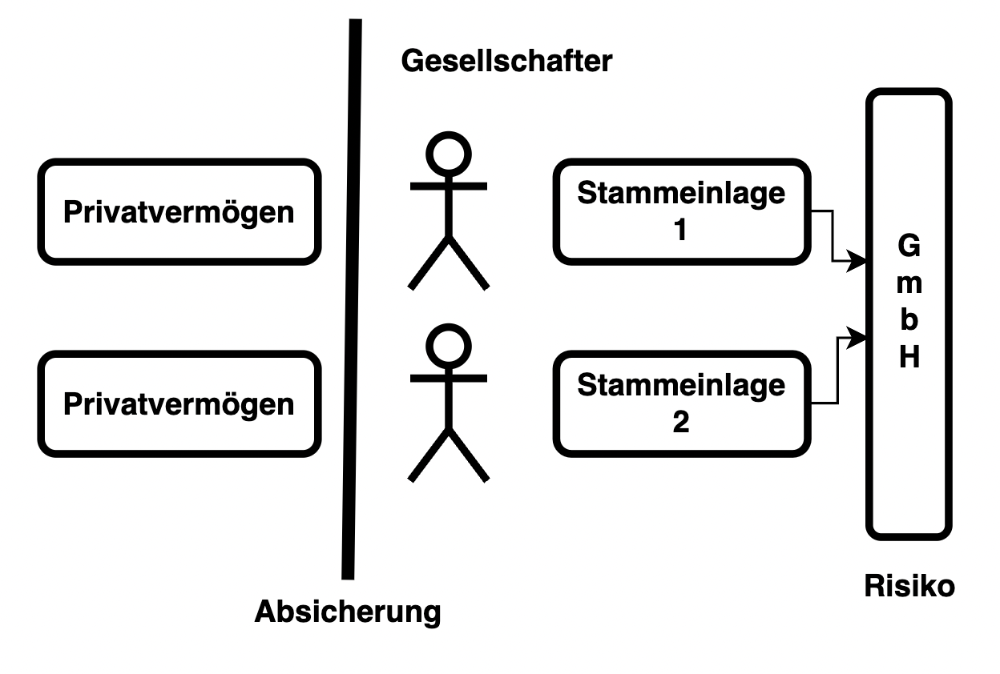

---
title: "Gesellschaft mit beschränkter Haftung"
author: Florian Flatscher, Moritz Mitterdorfer
date: "12. Mai 2022"
subject: "Gesellschaftsformen"
keywords: [GmbH]
subtitle: "4EHIF - 2022 - BWM"
lang: "de"
titlepage: true
titlepage-color: "1171ba"
titlepage-text-color: "FFFFFF"
titlepage-rule-color: "FFFFFF"
titlepage-rule-height: 2
toc: true
toc-own-page: true
book: true
...

# Überblick

Bei der Gesellschaft mit beschränkter Haftung (= *GmbH*) handelt es sich um eine Kapitalgesellschaft, die von
Gesellschaftern gegründet wird und mind. eine natürliche Person zum Geschäftsführer bestellt. Aufgrund Haftungsfragen
und diverser steuerrechtlichen Belangen, ist die GmbH eine beliebete Rechtsform sowohl für Startups als auch für
beständige Klein- und Mittelbetriebe. Sie stellt eine eigene juristische Person dar und unterliegt den Gesetzen des UGB.

Key-Facts:

- Kapitalgesellschaft
- Stammkapital durch Stammeinlagen
- beschränkte Haftung
- eigene juritische Person

# Zweck

Die Gründung der GmbH kann für jeden erlaubten Zweck erfolgen. Nicht erlaubt sind Zwecke verbunden mit:

- Versicherungen
- Bankgeschäfte
- Apotheken
- Notariate
- Tabak-Trafiken
- Rauchfangkehrer
- politischen Parteien

# Anwendbares Recht

Generell gilt für die GmbH das Unternehmensgesetzbuch (= UGB). Dazu kommen die Regelungen, die im Gesellschaftsvertrag
bestehen. Es gilt: Bei allem, was im Gesellschaftsvertrag nicht geregelt ist, greift das nationale oder etwaiges
transnationales Recht.

# Gründung

Die Gründung einer GmbH erfolgt im Gegensatz zu Personengesellschaften durch eine natürliche Person. Bei der Gründung
einer solchen Rechtsform muss nach der Art der GmbH unterschieden werden:

## Traditionelle Gründung
Ein Gesellschaftsvertrag wird zwischen allen Gesellschaftern in notariell beglaubigter Form abgeschlossen und gilt damit fortan. Der Vertrag muss dabei schriftlich sein und folgende Punkte beinhalten:

Ein Gesellschaftsvertrag wird zwischen allen Gesellschaftern in notariell beglaubigter Form abgeschlossen und gilt damit
fortan. Der Vertrag muss dabei schriftlich sein und folgende Punkte beinhalten:

| gesetzlicher Mindestinhalt       | optionaler Inhalt                              |
|----------------------------------|------------------------------------------------|
| Firma und Sitz der Gesellschaft  | Gründungsprivileg                              | 
| Gegenstand des Unternehmens      | Regelungen zur Geschäftsführung und Vertretung | 
| Höhe des Stammpaitals            | Generalversammlung                             | 
| Stammeinlagen der Gesellschafter | Beschlussfassung der Gesellschafter            |
|                                  | Gewinnverwendung                               |
|                                  | Aufgriffsrecht bzgl. Geschäftsanteilen         |
|                                  | Minderheitenrechte                             |
|                                  | ...                                            |

> Stammeinlagen der Gesellschafter: Betrag von jedem Gesellschafter, der auf das Stammkapital eingezahlt werden muss

Nachdem der Gesellschaftsvertrag fertiggestellt ist, wird die erste funktionale Geschäftsführung der GmbH bestellt.
Diese setzt sich aus einer (immer bei der Ein-Mann-GmbH) oder mehreren natürlichen Personen zusammen und trägt fortan
die Management-Entscheidungen der Gesellschaft.

Nach der konstitutiven Eintragung der Gesellschaft durch alle perönlich anwesenden Geschäftsführer ins Firmenbuch, ist
sie offiziell gegründet. Folgende Doukmente sind für die Eintragung notwendig:

- Gesellschaftsvertrag/Erklärung über die Errichtung der GmbH (notarielle beglaubigt)
- Gesellschafterliste
- Unterzeichnung der Gesellschafter
- Geschäftsführerverzeichnis
- Bankbestätigung (Einzahlung der Einlagen)
- evtl. Gutachten über den Firmenwortlaut

Sofern das Neugründungsförderungsgesetz nicht anwendbar ist, fallen bei der Eintragung ins Firmenbuch Gerichtsgebühren
an.

> Tipp: Bei der Gründung einer GmbH können eine Vielzahl von Privilegien und allgemeinen Förderungen in Anspruch
> genommen werden. Ein Beispiel hierfür ist die Jungunternehmer Top-Prämie die ab einer MIndestinvestition von €100.000,
> 10 % der Summe beträgt. Andere Förderungen: Austria Wirtschaftsservice (Aws), NeuFÖG (NeugründerInnen Förderungsgesetz)

## Alternative - Vereinfachte Gründung

Ungefähr 38 % aller GmbH-Gründung erfolgen durch eine einzige Person als Geschäftsführer und Gesellschafter. Liegt
sowhol ein Gesellschaftsvertrag als auch diese Voraussetzungen vor, kann die GmbH ohne Involvierung eines Notars auf
digitalem Weg gegründet werden. Dazu ist die elektronische Bürgerkarte und Zugang zum Unternehmensserviceportal
notwendig.

Der Vorteil hierbei ist, dass die Bank die Identität des Gründers prüft und bestimmte Dokumente an das Firmenbuchgericht weiterleitet, was zeitlich und aufandstechnisch ein großer Vorteil ist.

# Gründungsprivilegien

Allgemein beträgt das Stammkapital der GmbH €35.000, kann aber mithilfe des Gründungsprivilegs auf €10.000 in den ersten
10 Jahren herabgesetzt werden. Davon müssen €5.000 direkt bar eingezahlt werden - die andere Hälfte kann durch
Sacheinlagen erfolgen. Das Stammkapital ist bei Inanspruchnahme jedoch nach Ablaufen der 10-Jahres-Frist auf die
vorgeschriebenen €35.000 zu erhöhen.

Das Gründungsprivileg kann nur im Zuge der Gründung der GmbH angewendet werderden und muss hierbei in den
Gesellschaftsvertrag aufgenommen werden.

# Firma
Der Name der GmbH muss den Zusatz "GmbH", "Ges.m.b.H." oder "Gesellschaft m.b.H." führen und darf einen Namen, eine Sache, oder eine Fantasiebezeichnung beinhalten, wobei diese Namen nicht täuschend sein dürfen. Gegebenenfalls kann bei bestimmten Organisationen, wie der WKO, ein Check des Namens auf Rechtssicherheit durchgeführt werden. Der Name der Wortmarke kann auch durch eine Anmeldung beim Patentamt geschützt werden, wobei man dadurch das alleinige Nutzungsrecht des Firmennamens erhält. Der Firmenname wird im Firmenbuch eingetragen. Weriters darf der Name auch Personennamen beinhalten, aber nur die der Gesellschafter.

# Kapital und Rechtspersönlichkeit

Jeder Gesellschafter leistet in Form einer Stammeinlage einen Beitrag zum Stammkapital des Unternehmens. Diese Stammeinlage muss mindestens €70 betragen und darf variieren. Die Summe aller Stammeinlagen der Gesellschafter bildet das Stammkapital, das €35.000 beträgt, durch das Gründungsprivileg aber auch herabgesetzt werden kann. Gesellschaften mit beschränkter Haftung, die aus nur einem Gesellschafter und demnach nur einen Geschäftsführer bestehen werden als "Ein-Mann-GmbH" bezeichnet.

Der Eigentümer des Stammkapitals ist das Unternehmen selbst, was mit seinen finanziellen Mitteln wirtschaften kann.

Die GmbH nimmt eine eigene Rechtsperönlichkeit an. Sie stellt eine juritische Person dar und kann somit Recht erwerben, Verbindlichkeiten eingehen, klagen und geklagt werden. Dies ist ein erheblicher Vorteil, da sie beispielsweise Verträge abschließen oder die Verbindlichkeiten von Geschäften übernehmen kann.

# Haftung
Das Stammkapital gilt als Absicherung, da die Haftung des unternehmerischen Risikos des Unternehmens in der Regel nicht auf etwaiges Privatvermögen der Gesellschafter oder Geschäftsführer entäfllt.

Daher besteht keine direkte oder perönöliche Haftung der Gesellschafter. Jedoch muss sichergestellt sein, dass das Unternehmen über das vorgeschriebene Gesellschaftsvermögen durch miunter das Stammkapital verfügt. Weiters haften Geschäftsführer und Gesellschafter, die mehr als 50 % der Stammeinlage halten, mit einer Höhe von €4.000 für Kosten eines etwaigen Insolvenzverfahrens. 

Also gilt generell: Gesellschafter haften nie mit ihrem Privatvermögen für das Risiko der Gesellschaft, können aber ihre Stammeinlage verlieren.

# Organe

## Geschäftsführung und ihre Vertretung

Generelle Definition des handelsrechtlichen Geschäftsführers, wobei zwischen Innen- und Außenverhältnis unterschieden
werden muss:

\

| Innenverhältnis       | Außenverhältnis             |
|-----------------------|-----------------------------|
| Führung der Geschäfte | Vertretung der Gesellschaft |

Die Geschäftsfürhung umfasst die GeschäftsführerInnen, die stets natürliche Personen sind und von der Generalversammlung
bestellt werden. Weiters müssen die Personen eine rechtliche Handlungsfähigkeit aufweisen und sind im Firmenbuch
anzumelden. Die Anzahl der Geschäftsführer wird im Gesellschaftsvertrag geregelt, wobei es mindestens einen
Geschäftsführer geben muss.

Die Tätigkeitsbereiche der Geschäftsführung umfassen:

- Vertretung
- Geschäftsleitung
- Jahresabschluss
- Überwachung der finanziellen Lage
- Sendung von Reports (Jahresabschluss, Lageberichte, etc.) an die Gesellschafter
- Auskunftserteilung an Gesellschafter
- Einberufung der Generalversammlung
- Anmeldung im Firmenbuch

Sofern der Gesellschaftsvertrag keine anderen Regelungen enthält, wird die Gesellschaft durch alle Geschäftsführer
gleichermaßen vertreten (= Gesamtvertretung). Anders hingegen ist die Einzelvertretung, bei der das Unternehmen nur
durch einen einigen Geschäftsführer vertreten wird.

Blickt man auf die Haftung der GmbH und der Geschäftsführung wird klar, dass der Geschäftsführer bei ordentlicher,
gewissenhafter und fachlich einwandfreien Unternehmensfürhung keine persönliche Haftung für das unternehmerische Risiko
der GmbH übernimmt. Verletzt er jedoch eine dieser Pflichten, wird die Haftung gegenüber einzelnen Parteien verletz.

Die Tätigkeit der Geschäftsfürhung endet mit ihrer Abberufung durch einen Beschluss der Gesellschafter. Eine solche
Abberufung wird mit einer einfachen Stimmenmehrheit erwirkt und ist jederzeit gültig.

# Gewerbeberechtigung
Eine Vielzahl von Tätigkeiten uneterliegen der Gewerbeordnung. Möchte die Gesellschaft solche Tätigkeiten ausüben, benötigt sie eine Gewerbeberechtigung, die auf die Gesellschaft selbst lautet. Hat nur ein einzelner Gesellschafter eine solche Gewerbeberechtigung, so gilt dies nicht. 

Fällt ein Unternehmen unter die Gewerbeordnung, muss es einen gewerberechtlichen Geschäftsführer bestellen, also entweder den handelsrechtlichen Geschäftsführer selbst oder einen solzialversicherungspflichtigen Arbeitnehmer, der mindestens die Hälte der üblichen wöchentlichen Arbeitsstunden im Betrieb tättig ist.

# Bilanzierungspflicht
Aufgrund der Tatsache, dass die Gmbh unternehmensrechtlichen Regelungen unterliegt, muss sie einen vollen Jahresabschluss aufstellen und diesen beim Finanzamt einreichen. Dieser volle Jahresabschluss umfasst:

- Gewinn- und Verlustrechnung (GuV) - extern
- Bilanz - extern
- Lagebericht - intern
- Eigenkapitalveränderung - intern
- Kapitalfluss - intern

Außerdem muss die Geschäftsführung Auskunft und Informationen gegenüber den Gesellschaftern erteilen, wobei der Jahresabschluss (extern und intern) eine große Rolle spielt. Für das Finanzamt ist neben den steuerrechtlichen Angaben nur die GuV-Rechnung und die Bilanz von Bedeutung (extern).

# Gewinnverteilung und Entnahmerecht
Thesaurierung

# Steuern

Die Rechtsform eines Unternehmens bestimmt wie **Körperschaftssteuer** und **Einkommensteuern**, oder **
Kapitalertragssteuer**, hand zu haben sind. Für ein neugegründetes Unternehmen ist die GmbH als Rechtsform steuerlich
gesehen oftmals ungünstig. Anders als Personengesellschaften unterliegt die GmbH als Kapitalgesellschaft der
Kapitalertragssteuer und nicht der Einkommensteuer.

#### Körperschaftssteuer (KöSt)

Als juristische Person unterliegt der Gewinn der GmbH der Körperschaftssteuer von **25%**. Wie für alle Kapitalgesellschaften gibt es für die GmbH zusätzlich eine Mindestkapitalsteuer (Mindest-KöSt). Diese gibt vor, als GmbH unabhängig vom Gewinn mindestens €1.750 KöSt pro Jahr anzubringen. Für eine AG
beträgt die Mindestkapitalsteuer €3.500. Allerdings muss seit 2013 nicht von anfang an die volle Kindest-KöSt bezahlt
werden.

| Zeitraum          | Mindest-KöSt pro Jahr |
|-------------------|-----------------------|
| Nach der Gründung | €500                  |
| Nach 5 Jahren     | €1.000                |
| Nach 10 Jahren    | €1.750                |

#### Kapitalertragssteuer (KESt)

Bei der Kapitalertragssteuer handelt es sich um eine Form von Einkommensteuern. Wenn eine beteiligte natürliche Person
einer person aus einer Gewinnausschüttung Geld zieht, dann sind wiederum Kapitalertragssteuer einzubringen. In diesem
Fall handelt es sich um Einkünfte aus Kapitalvermögen und somit beträgt der Steuersatz, seit 2016, **27,5 %**.

Einfach zusammengefasst gibt die GmbH von jedem Gewinn 25 % Körperschaftssteuer ab. Wenn das Geld nicht in der Firmer
bleibt, sondern an die Gesellschafter ausgeschüttet wird, kommt zusätzlich 27,5 % Kapitalertragssteuer hinzu.
Zusammengerechnet gibt es also eine Gesamtbesteuerung von **45,625 %**.

Der Einkommenssteuertarif, bezahlt von Personengesellschaften, ist anders als die Körperschaftssteuer in sieben Stufen
gestaffelt, die von 0 % zu €11.000 bis 55 zu €1.000.000 reichen. Bei €30.000 gibt es mit 2022 max 15 % des Gewinnes zu
bezahlen. Da Körperschaftssteuer, bezahlt von Kapitalgesellschaften, seit 2005 unabhängig von Gewinn ist, gibt es eine
Gewinngrenze, ab der die Gründung einer GmbH steuerlich günstig ist. Die Steuerbelastung von ESt und KöSt ist bei einem
Gewinn von etwa €49.200 ausgeglichen. Rein steuerlich gesehen, macht eine GmbH also ab Jahreseinkommen von über €49.200
sinn, es gibt allerdings auch andere wichtige Faktoren, wie z.B. die Verwaltungskosten, oder die Lohnnebenkosten.

Bei längeren Verlustphasen kann es durch die höhere besteuerung der GmbH also durchaus rentabel zu sein, eine
begünstigte Umwandlung der Rechtsform in ein Einzelunternehmen oder eine Personengesellschaft durchzuführen. Dabei gibt
es ein Umgründungssteuergesetz, längerfristig kann dieses aber weniger als die Mindestkörperschaftssteuer sein. Es gibt
aber bestimmte Kriterien und Auswirkungen einer begünstigten Umwandlung, weshalb diese gut überlegt werden muss.
Beispielsweise gibt es eine sofortige Versteuerung nicht ausgeschütteter Gewinne mit der Kapitalertragssteuer.

# Sozialversicherung

FlO

# Beendigung der Gesellschaft

FLO

# Vor- und Nachteile

FLO / MO

# Beispiele

FLO / MO

# Vergleichsformen

Ltd. England
C und S Corporation in den USA
FLO / MO

# Quellen

- WKO, https://www.wko.at/service/wirtschaftsrecht-gewerberecht/Gesellschaft_mit_beschraenkter_Haftung_(GmbH).html,
  16.05.2022
- Selbstständig
  machen, https://www.selbststaendig-machen.at/foerderungen-fuer-jungunternehmer-in-oesterreich/#:~:text=Austria%20Wirtschaftsservice%20(Aws),5.000%20und%2020.000%20Euro%20vergibt
  ., 17.05.2022
- WKO, https://www.wko.at/service/wirtschaftsrecht-gewerberecht/Handelsrechtlicher_Geschaeftsfuehrer.html, 17.05.2022
- WKO, https://www.wko.at/service/steuern/einkommensteuer-koerperschaftsteuer.html
- WKO, https://www.wsw-steuerberater.at/steuernews_fuer_klienten/mai_2015/wie_hoch_ist_die_steuer_bei_einer_gmbh_/
- Österreich.gv https://www.oesterreich.gv.at/lexicon/K/Seite.991650.html
- Am Punk, Recht für Technikerinnen und Techniker, 17.05.2022
- WKO, https://www.wko.at/service/wirtschaftsrecht-gewerberecht/Gesellschaft_mit_beschraenkter_Haftung_(GmbH)_-_FAQs.html, 17.05.2022

AG is besser wegen Namen und verbundenen Ansehen
Haftung und Steuern
Wenn man keine 70.000 für AG hat
